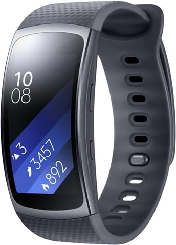
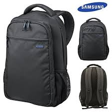
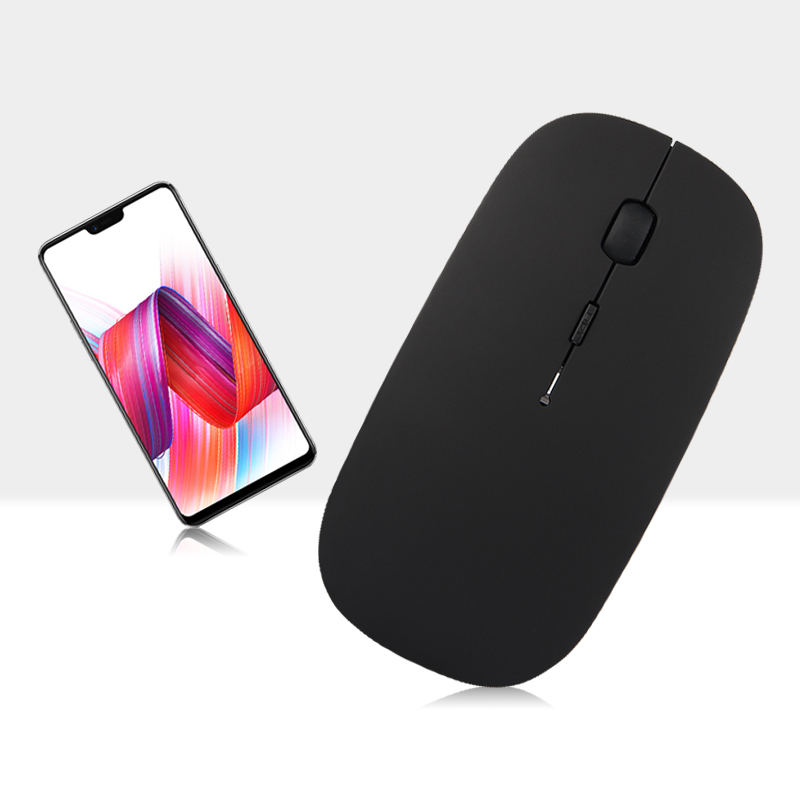

# Product_card
## Date:
## Objective:

To replicate a product card layout similar to those found on real-time e-commerce platform like FlipKart using the CSS Box Model (margin, border, padding, and content).

## Tasks:

#### 1. Structure the HTML Layout:
Create a container ```<div>``` for the product card.

Add an `````` for the product image.

Include ```<h2>``` for product name, ```<p>``` for description, and a ```<span>``` or ```<div>``` for price.

Add a “Buy Now” or “Add to Cart” button.

#### 2. Apply Box Model Styling in CSS:
Use padding inside each section (image, text, button) to ensure readability.

Use margin around the card to space it from the page edges or other cards.

Add a border to outline the card.

Control width and height for consistent sizing.

#### 3. Visual Styling:
Add a background color to the card container.

Use box-shadow to simulate depth (card lifting effect).

Add border-radius for rounded corners.

#### 4. Center the Card:
Use display: flex and justify-content: center and align-items: center on the parent container.

#### 5. Bonus Enhancements:
Use a hover effect on the button (e.g., background color change).

Make the card responsive with percentage-based widths or media queries.
## HTML Code:
```
<!DOCTYPE html>
<html lang="en">
<head>
  <meta charset="UTF-8" />
  <meta name="viewport" content="width=device-width, initial-scale=1.0" />
  <title>Flipcart Clone</title>
  <link rel="stylesheet" href="style.css" />
</head>
<body>
  <header>
    <h1>Flipcart</h1>
  </header>

  <main class="product-container">
    <div class="product-card">
      
      <h2>Smartphone X10</h2>
      <p>Powerful performance with sleek design.</p>
      <div class="price">₹80,899</div>
      <button>Add to Cart</button>
    </div>

    <div class="product-card">
      
      <h2>Bluetooth Headphones</h2>
      <p>Crystal clear sound and long battery life.</p>
      <div class="price">₹8,499</div>
      <button>Add to Cart</button>
    </div>

    <div class="product-card">
      
      <h2>Fitness Band</h2>
      <p>Track your daily activities with ease.</p>
      <div class="price">₹4,999</div>
      <button>Add to Cart</button>
    </div>

    <div class="product-card">
      
      <h2>Laptop Bag</h2>
      <p>Stylish and spacious for daily use.</p>
      <div class="price">₹2500</div>
      <button>Add to Cart</button>
    </div>

    <div class="product-card">
      
      <h2>Wireless Mouse</h2>
      <p>Comfortable and precise tracking.</p>
      <div class="price">₹3000</div>
      <button>Add to Cart</button>
    </div>
  </main>
</body>
</html>

```

## CSS Code:
```
* {
  box-sizing: border-box;
  margin: 0;
  padding: 0;
}

body {
  font-family: Arial, sans-serif;
  background-color: #f1f3f6;
}

header {
  background-color: #2874f0;
  padding: 20px;
  text-align: center;
}

header h1 {
  color: white;
  font-size: 32px;
  letter-spacing: 1px;
}

.product-container {
  display: flex;
  flex-wrap: wrap;
  justify-content: center;
  padding: 30px;
  gap: 20px;
}

.product-card {
  background-color: #fff;
  border: 1px solid #ddd;
  border-radius: 12px;
  box-shadow: 0 2px 6px rgba(0,0,0,0.1);
  width: 250px;
  padding: 16px;
  text-align: center;
  transition: transform 0.3s;
}

.product-card:hover {
  transform: translateY(-5px);
}

.product-card img {
  width: 100%;
  height: auto;
  border-radius: 8px;
  margin-bottom: 12px;
}

.product-card h2 {
  font-size: 18px;
  margin-bottom: 6px;
  color: #333;
}

.product-card p {
  font-size: 14px;
  color: #666;
  margin: 8px 0;
}

.product-card .price {
  font-size: 16px;
  color: #e91e63;
  margin-bottom: 10px;
}

.product-card button {
  padding: 10px 16px;
  background-color: #2874f0;
  color: white;
  border: none;
  border-radius: 6px;
  cursor: pointer;
  transition: background-color 0.3s;
}

.product-card button:hover {
  background-color: #0b57d0;
}

@media (max-width: 768px) {
  .product-container {
    flex-direction: column;
    align-items: center;
  }

  .product-card {
    width: 90%;
  }
}

```
## Output:


## Result:
A product card layout similar to those found on real-time e-commerce platform like FlipKart using the CSS Box Model is replicated successfully.
